# AI-IDS Project

## 📝 Overview
AI-IDS is a Python-based intrusion detection system that processes PCAP network traffic and detects suspicious behavior using machine learning. It provides an interactive Streamlit dashboard for easy visualization.

⚠️ **Note:** Zeek (Bro) could not be used due to dependency conflicts on Kali Linux (missing BIND, libc version issues). Scapy was used instead for packet parsing, ensuring a fully functional pipeline.

---


## ⚙️ Features
- **PCAP Analysis:** Supports custom PCAP file uploads.
- **ML-based Detection:** LightGBM model classifies traffic as `BENIGN` or `SUSPICIOUS`.
- **Interactive Dashboard:** Visualizes packet summaries, attack probability, and counts.
- **Automated Pipeline:** Upload → Extract → Predict → Visualize.

---

## 🏗️ Project Structure

AI_IDPS_Project/
├── dashboard.py # Streamlit dashboard
├── pcap_ids.py # ML inference pipeline
├── pcap_feature_extractor.py # Packet parsing & feature extraction
├── models/
│   ├── ids_model.pkl # LightGBM IDS model
│   └── igbm_model.pkl # Optional additional model
├── sample_pcaps/
│   └── 2026-02-28-traffic-analysis-exercise.pcap
├── requirements.txt # Python dependencies
└── README.md # Project documentation


---

## 🖥️ Screenshots
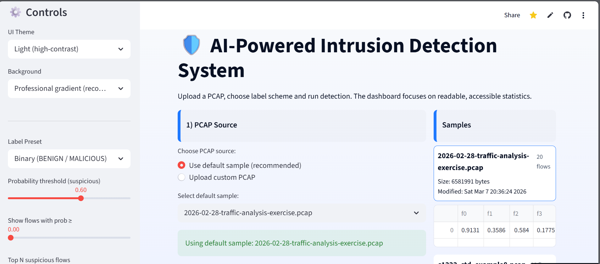

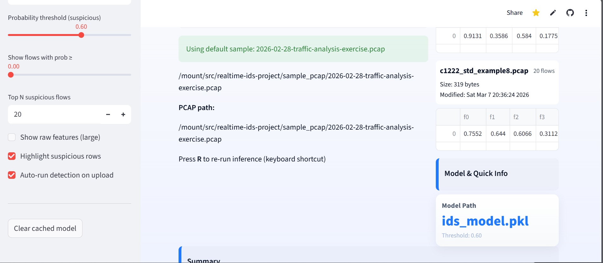

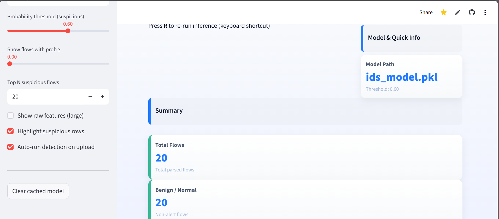

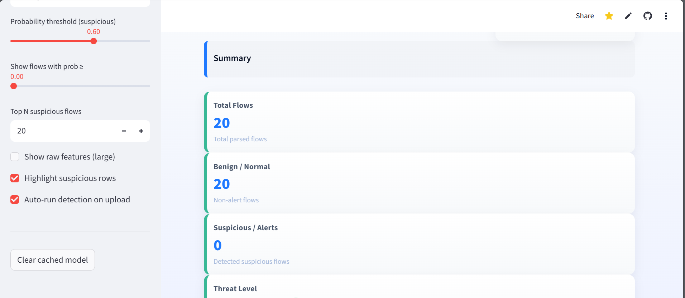

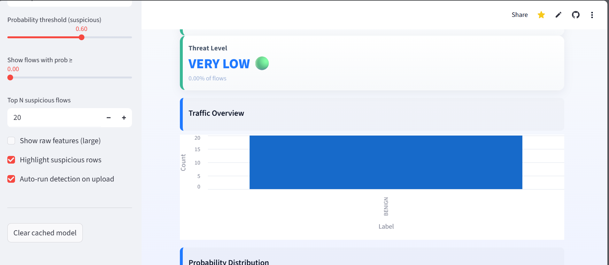

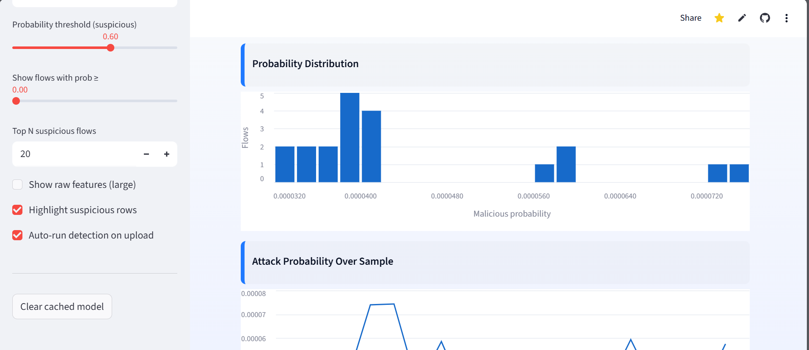

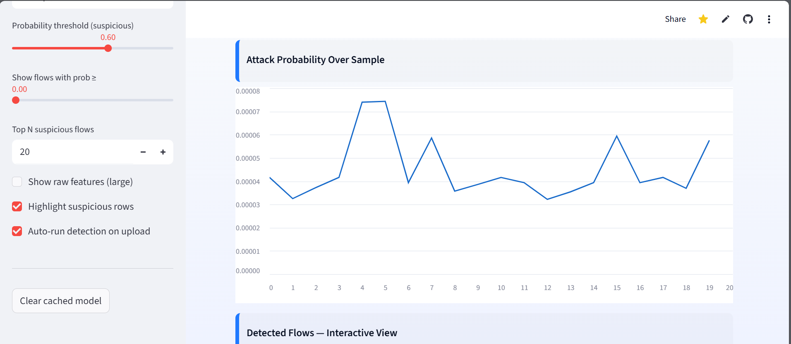

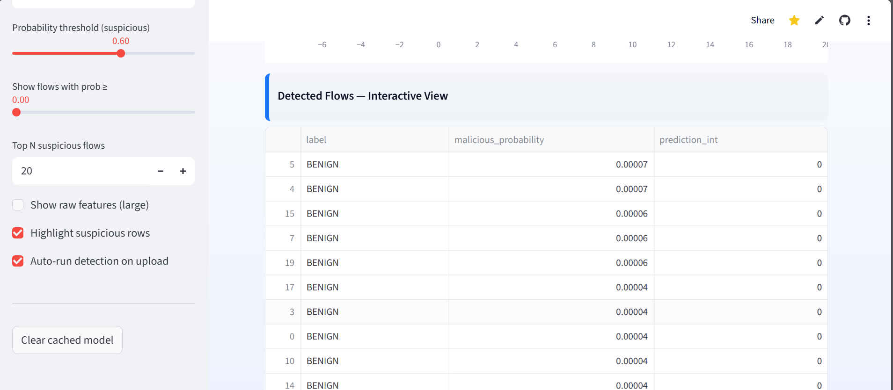

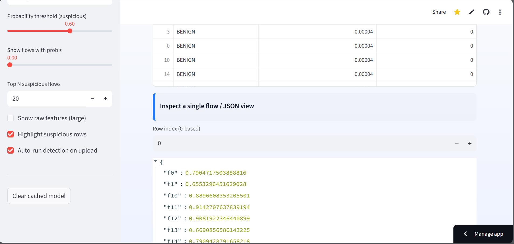

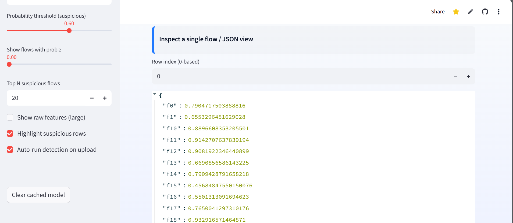

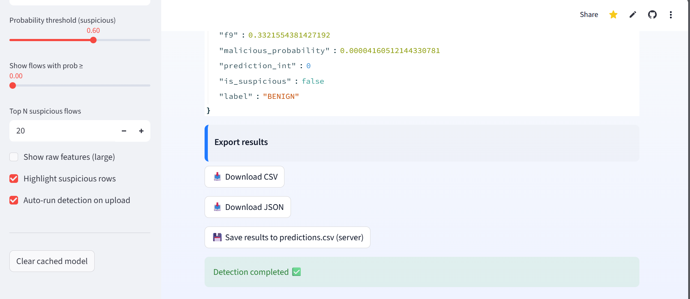

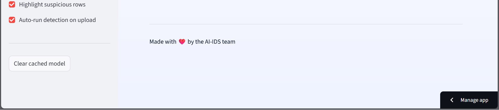
---

## 💻 Installation

Step-by-step instructions:

1. Clone the repository:
   ```bash
   git clone https://github.com/Sultann1111/RealTime-IDS-Project.git
   cd RealTime-IDS-Project

Create a virtual environment and activate it:

python -m venv venv
source venv/bin/activate   # Linux/Mac
venv\Scripts\activate      # Windows

Install dependencies:

pip install -r requirements.txt
▶️ Running the Dashboard
streamlit run dashboard.py

Opens a browser interface.

Upload your PCAP file or use the sample.

Visualize predictions, packet counts, and attack probabilities.

🧩 How AI-IDS Works

Upload PCAP file.

Extract features using Scapy.

Apply LightGBM ML model.

Display predictions (BENIGN or SUSPICIOUS) with probabilities.

Visualize summaries and insights in the Streamlit dashboard.

⚠️ Why Zeek Was Not Used

Zeek was replaced with Scapy due to missing dependencies on Kali Linux (BIND, libc version conflicts). Scapy allows full packet parsing while maintaining pipeline integrity.

🔬 Machine Learning Model

Type: LightGBM classifier

Input: Extracted features from PCAPs

Output: BENIGN or SUSPICIOUS + probability

Handling Missing Features: Automatically padded to match model input

🚀 Future Enhancements

Real-time network capture and analysis.

Additional ML features for higher detection accuracy.

Cloud deployment for live monitoring.

Reintroduce Zeek or Suricata when dependencies allow.

📜 License

For educational and research purposes only.

🙏 Acknowledgements

Research in ML for cybersecurity.

Open-source projects: Scapy, LightGBM, Streamlit.

Academic references on network intrusion detection.